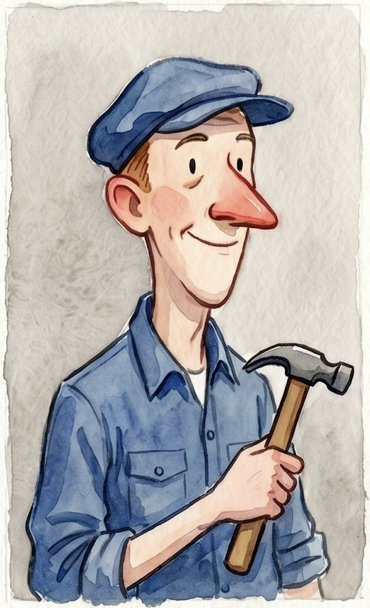
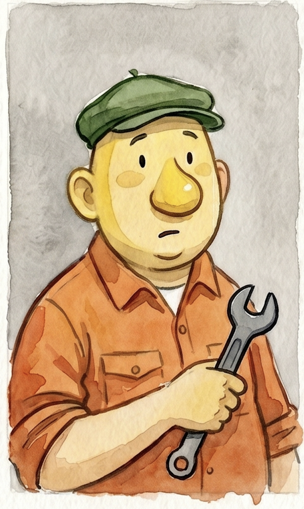
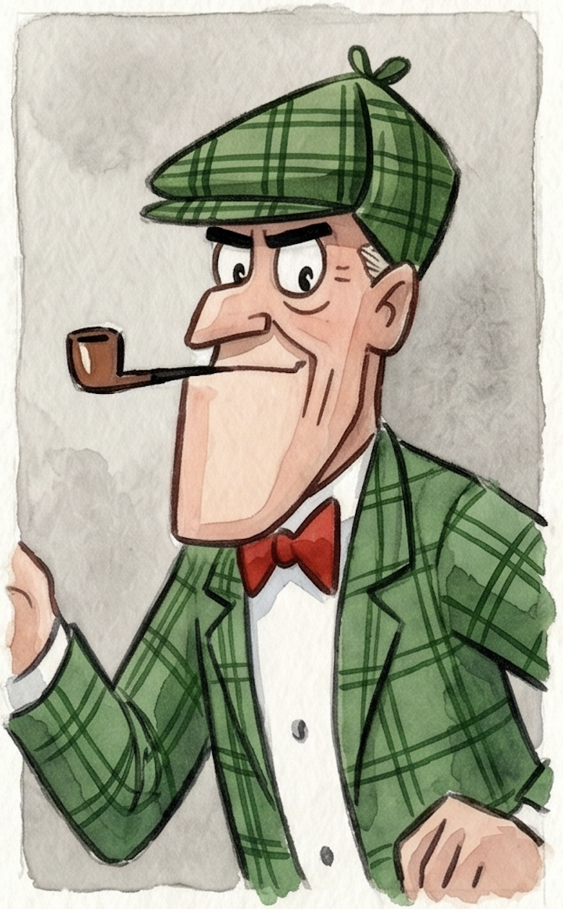
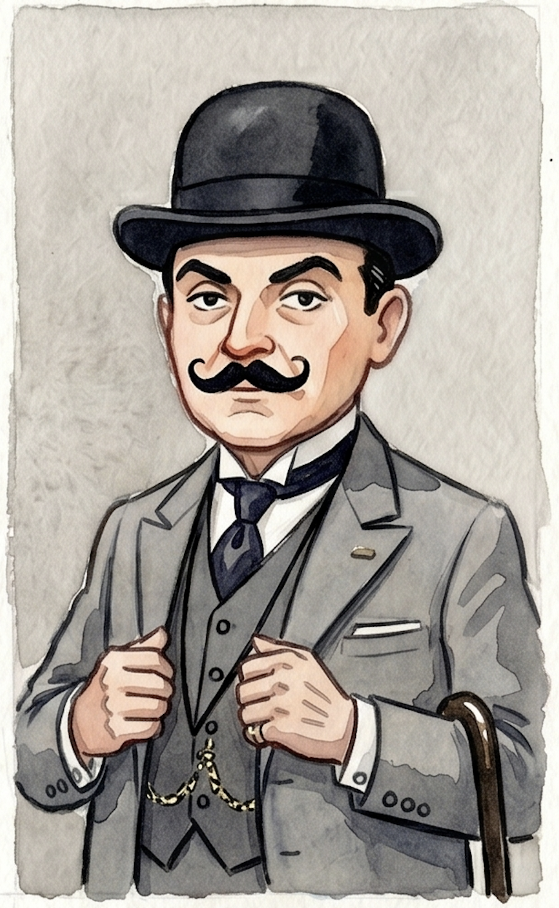

# dev-system
<table>
  <tr>
    <td width="50%">
      
    </td>
    <td width="50%">
      Personal AI development workflow — skills, scripts, and configs for working with Claude Code and Gemini CLI.
    </td>
  </tr>
</table>
## The roster

| | Name | Role | Tool |
|---|---|---|---|
|  | **Pat** | Worker | Claude |
|  | **Mat** | Worker | Gemini |
|  | **Nikke** | Investigator | Claude |
|  | **Poirot** | Reviewer | Claude |
| | **Watson** | Context gatherer | Gemini Flash |

## Setup on a new machine

```bash
git clone <this-repo-url> ~/code/dev-system
cd ~/code/dev-system
./install.sh
source ~/.zshrc
detect-stack # verify it works in any git repo
```

## Daily workflow

### Standard bug flow

```bash
# 1. Copy ticket to clipboard, then:
nikke -t PROJ-123-bug-name

# 2. Read .vscode/ai/INVESTIGATION.md in Nikke's worktree
# 3. Dispatch Pat with Nikke's findings:
pat -n bug/PROJ-123-bug-name

# 4. When Pat finishes, jump to its worktree and review:
goto pat
poirot

# 5. Commit, push PR, clean up:
wt-clean pat nikke
```

### Pat vs Mat duel

```bash
duel -n fix/PROJ-123-branch      # spins both with Nikke's investigation
goto pat
poirot --compare                  # Poirot compares both, gives verdict
wt-clean pat mat nikke
```

### Commands

| Command | Description |
|---|---|
| `watson -t <title>` | Map codebase context for a ticket (Gemini Flash) |
| `nikke -t <title>` | Investigate ticket from clipboard (Watson runs first) |
| `nikke --no-watson -t <title>` | Investigate without Watson pre-mapping |
| `pat <branch> "task"` | Claude worker on a new branch |
| `pat -n <branch>` | Claude worker, pulls Nikke's investigation |
| `mat <branch> "task"` | Gemini Flash worker on a new branch |
| `mat -n <branch>` | Gemini Flash worker, pulls Nikke's investigation |
| `duel [-n] <branch>` | Spin Pat and Mat on the same task |
| `poirot` | Review current worktree |
| `poirot --compare` | Compare Pat vs Mat, give verdict |
| `roster` | Show active worktrees and status |
| `goto <pat\|mat\|nikke>` | Jump to role's tmux window/worktree |
| `wt-clean <role\|all>` | Remove worktrees after merge |

## Editing workflow

Files are symlinked into `~/dev-system/`, `~/.claude/`, `~/.gemini/`. Edit
them anywhere — the repo files are the live files.

```bash
nvim ~/dev-system/skills/_work/conservative.md # via the symlink
cd ~/code/dev-system
git diff
git add -A
git commit -m "tweak conservative skill"
git push
```

## Pulling updates on another machine

```bash
cd ~/code/dev-system
git pull
./install.sh # idempotent
```

## Skill boundary

**Skills never contain work IP, codebase specifics, or team conventions.**
Those belong in each repo's `AGENTS.md`. Skills only describe behavior
preferences and stack-generic patterns.

When tempted to add work-specific knowledge to a skill, push it to the
team's `AGENTS.md` instead — it belongs where teammates can read it.

## Portraits

Drop PNGs into `portraits/` named `pat.png`, `mat.png`, `nikke.png`,
`poirot.png`, `watson.png`. Empty placeholders are fine — scripts fall back
to bold text until real images are present.
